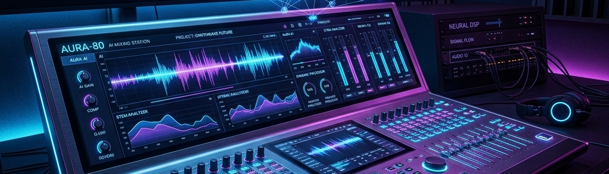

  

  # 🎛️ Rickc Audio Engineer Public

  **录音棚级 AI 音乐创作全流程助手 (Suno AI 专业提示法)**

  
  
  
  
  *把“人声怎么唱 + 混音台怎么调 + 效果器加多少”转化为结构化指令， 让 AI 不凭感觉瞎猜，直接复刻出录音棚级别的成品。*

---

## 📖 目录 (Table of Contents)
- [🌟 为什么需要这套系统？](#-为什么需要这套系统)
- [🎯 核心特性](#-核心特性)
- [🧩 资源库结构](#-资源库结构)
- [🚀 快速开始](#-快速开始)
- [🤝 贡献与反馈](#-贡献与反馈)

---

## 🌟 为什么需要这套系统？

目前大多数 AI 音乐创作者依然在使用“情感描述 + 简单曲风标签”的方式生成歌曲，这往往会导致：

1. 🎚️ **声音过度处理**：频段混乱，人声与伴奏糊在一起。
2. 🌊 **缺乏起伏与动态**：副歌不够炸，主歌不够静。
3. 🎭 **声音缺乏特质**：歌手声线千篇一律，缺乏真实的呼吸感与质感。

**Rickc Audio Engineer** 是一套开源的专业音乐提示词框架（主要针对 Suno AI 等基于文本提示的音频生成大模型）。它引入了传统 DAW（数字音频工作站）中的**分层混音参数前置化**概念，将专业制作人的经验通过提示词“物理性”地约束 AI 的音频生成空间。

---

## 🎯 核心特性

- 🎛️ **参数级精确控制 (Layer 2 压缩策略)**
  将复杂的 `EQ（均衡）`、`Compression（压缩）`、`Reverb（混响）` 和 `Mastering（母带）` 设置，安全压制在 950 字符的硬限以内。
- 🎙️ **录音棚级人声定制**
  不再是简单的“女声/男声”，而是精确到 `Alto to Soprano`, `Breathy Head Voice`, `Subtle Vibrato` 等发声技术与共鸣腔体的描述。
- 🤖 **Agent 友好化设计**
  高度结构化的 Markdown 资源库，完美适配 OpenClaw, Hermes 等基于 RAG 检索的 AI Agent 作为外挂技能 (Skill) 调用。

---

## 🧩 资源库结构

本框架通过将知识库解耦为五大独立模块，实现高效拼装：

| 模块文件 | 作用说明 |
| :--- | :--- |
| 📁 [`genre-library.md`](resources/genre-library.md) | 不同流派（J-Pop, K-R&B, Phonk 等）的底层节奏、和声进行及合成器设置 |
| 📁 [`vocal-design-library.md`](resources/vocal-design-library.md) | 按音域、情绪、技巧分类的专业人声配置词典 |
| 📁 [`lyrics-optimization.md`](resources/lyrics-optimization.md) | 中/英/日/韩四语的韵脚体系、元音控制及发音优化技巧 |
| 📁 [`music-trends.md`](resources/music-trends.md) | 基于 TikTok / YouTube 的爆款公式与数据洞察 |
| 📁 [`song-history.md`](resources/song-history.md) | 标准化的迭代实验记录模板，帮助你沉淀独家“配方” |

---

## 🚀 快速开始

如果你是一位使用 OpenClaw、Hermes 或任何支持读取系统预设的大模型 Agent 开发者，你可以直接将本仓库作为 **Skill (技能包)** 载入。

对于普通创作者，可以直接查阅核心调度文件 [`SKILL.md`](SKILL.md)，使用内嵌的工作流让 ChatGPT/Claude 帮你组装提示词。

### 创作流示例

<b>展开查看从想法到 Prompt 的转化过程</b>

 

**1. 输入意图：**
> “帮我写一首日系动漫 ED，要很慢很忧郁，高潮部分要有弦乐爆发。”

**2. 知识库提取 (Agent/手动)：**
- 查阅 `genre-library` 提取 J-Pop Ballad 的 BPM 和乐器配置。
- 查阅 `vocal-design-library` 提取幻梦女声的演唱技法。

**3. 输出压缩 (Layer 2 参数块)：**
自动生成一段严格控制在 600-850 字符以内、带有 `[EQ]`, `[REVERB]` 等混音术语的高度连贯段落。

**4. 粘贴生成：**
将生成的文本粘贴至 Suno，即可获得远超同类“盲盒抽卡”质感的录音棚级音乐。

---

## 🤝 贡献与反馈

这套 SOP 汲取了大量传统音乐工程经验。如果你有关于如何更好用 Prompt 控制音乐 AI 的技巧（尤其是针对 Suno v5 等新架构），欢迎提交 Issue 或 Pull Request！

 

  <i>Created by <a href="https://github.com/rickai0118">rickai0118</a> / Optimized for AI Music Creators</i>

